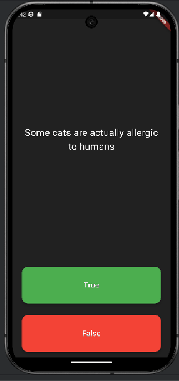

# Quizzler ❓
A Flutter Quiz App to Test Your General Knowledge

## 📱 Overview
Quizzler is a quiz app built with Flutter that challenges users with interesting facts. The app demonstrates concepts of **Stateful** and **Stateless Widgets** while reinforcing key principles of **Object-Oriented Programming (OOP)** in Dart. This project is inspired by **The Complete Flutter Development Bootcamp with Dart** on Udemy.

---

## Demo Video

---

## 🎯 Goal
The primary goal of this project is to review Flutter’s widget system and enhance understanding of **classes, objects**, and modular code structure. By the end, you’ll have a fully functional quiz app that can be customized with your own quiz ideas.

---

## 🚀 Features
- **True/False Questions**: Test general knowledge with interactive questions.
- **OOP Implementation**: Modular code using Dart classes and objects.
- **State Management**: Explore the difference between Stateful and Stateless Widgets.
- **Customizable**: Easily modify or add questions to create unique quizzes.

---

## 🛠️ What I Learn
- **Modularizing code** into separate classes.
- Using **class constructors** for efficient object creation.
- Understanding **public and private modifiers** in Dart.
- **Refactoring code** by extracting widgets for cleaner structure.
- Handling data using **Dart Lists**.
- Differentiating between **var, const, and final** in Dart.

---

## 📚 Resources
- **Flutter Documentation**: [flutter.dev](https://flutter.dev)
- **Dart Language**: [dart.dev](https://dart.dev)
- **Course Reference**: *The Complete Flutter Development Bootcamp with Dart* by Angela Yu  

